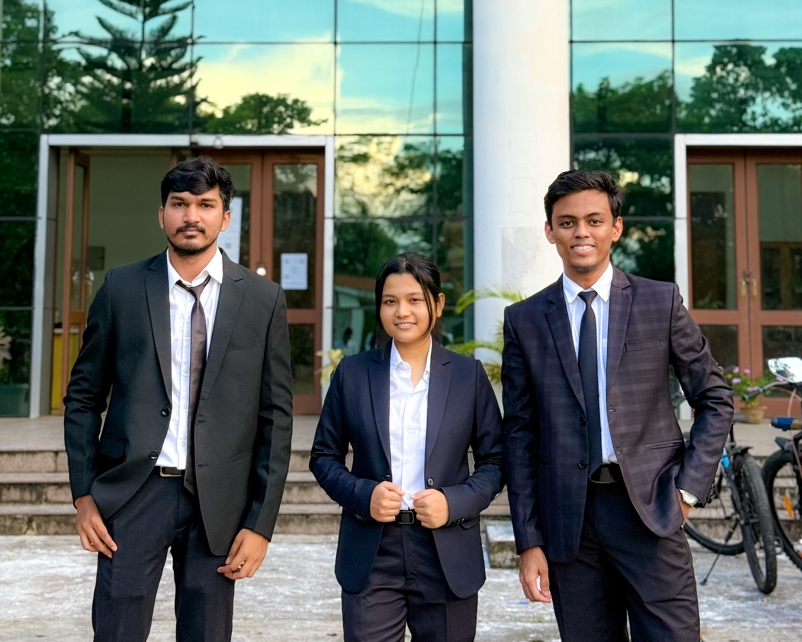

# High-Voltage Plasma Assisted Water Purification for Removal of Microplastics and Impurities from Drinking Water

Welcome!  
This repository serves as the **central documentation hub** for my final-year B.Tech project in **Electrical Engineering**, focused on the **application of high-voltage plasma technology for drinking water purification**, with particular emphasis on the **removal of microplastics and other persistent impurities**.

Unlike conventional academic reports that summarize outcomes after completion, this repository is designed as a **living engineering logbook**, capturing the project *as it unfolds*, from early conceptualization and hardware prototyping to experimental trials, observations, failures, refinements, and results.

<div align="center">
  
</div>

At its core, this project explores the interaction between **non-thermal plasma and water systems**, leveraging high-voltage electrical discharges to induce physicochemical processes capable of degrading, fragmenting, or separating microplastics and other contaminants. The work sits at the intersection of **high-voltage engineering, plasma physics, and environmental sustainability**.

To accurately reflect the experimental and research-oriented nature of the project, the documentation is structured around:
- Progressive **hardware development and iteration**
- Controlled **laboratory experiments**
- Detailed **observations and parameter studies**
- Transparent reporting of **unexpected behavior, limitations, and design trade-offs**

Rather than compressing months of work into a single final document, the repository is organized into **experiment-wise and system-wise records**, each maintained with clarity, traceability, and reproducibility in mind.

Each major subsystem, experiment, and result set is documented in its own dedicated file or folder, all indexed from this master `README` to allow **chronological tracking or focused technical reference**.

This repository is intended to function not merely as a project submission artifact, but as a **research-grade technical record**—structured, honest, and reflective of real-world experimental engineering.

---

## 📌 Read Before You Start

This repository documents the ongoing work of a **high-voltage plasma–assisted water purification project** as it evolves through design iterations, hardware experiments, and laboratory observations. It is not intended to be a step-by-step tutorial, but rather a **transparent and faithful record of experimental engineering in practice**.

Before exploring the contents, please keep the following in mind:
- The documentation is organized **experiment-wise and system-wise**, closely reflecting the actual progression of the project.
- Certain phases may emphasize **debugging, calibration, safety validation, or repeated trials** rather than immediate visible results.
- Observations include **unexpected behavior, partial successes, and limitations**, documented deliberately for technical honesty and learning value.
- High-voltage and plasma systems are inherently sensitive; **results may vary** with setup, environment, and operating conditions.
- Suggestions, corrections, and technical discussions are always welcome and encouraged.

If you find this repository useful for research, academic work, or experimental reference, consider sharing it with others working in **plasma engineering, high-voltage systems, or water treatment technologies**.

---
## 📜 Repository Structure

```
HV-Plasma-Water-Purification/
│
├── README.md
│
├── docs/
│   ├── project_overview.md
│   ├── literature_review.md
│   ├── system_architecture.md
│   ├── experimental_methodology.md
│   ├── safety_protocols.md
│   ├── results_and_analysis.md
│   └── limitations_and_future_work.md
│
├── hardware/
│   ├── schematics/
│   │   ├── hv_power_supply.pdf
│   │   └── electrode_layout.png
│   │
│   ├── hv_circuit_design.md
│   ├── electrode_design.md
│   └── plasma_reactor.md
│
├── experiments/
│   ├── experiment_logbook.md
│   ├── exp_01_baseline_characterization.md
│   ├── exp_02_plasma_generation_validation.md
│   ├── exp_03_microplastic_treatment_sine_wave.md
│   └── exp_04_microplastic_treatment_square_wave.md
│
├── data/
│   ├── raw/
│   │   ├── uv_vis/
│   │   ├── ftir/
│   │   └── sem/                # (planned)
│   │
│   ├── processed/
│   │   ├── cleaned_spectra/
│   │   └── summary_tables/
│   │
│   └── plots/
│       ├── uv_vis_plots/
│       ├── ftir_plots/
│       └── comparison_plots/
│
├── images/
│   ├── setup/
│   ├── plasma_discharge/
│   ├── samples/
│   └── results/
│
├── references/
│   ├── papers.bib
│   └── key_papers.md
│
├── LICENSE
├── CONTRIBUTING.md
└── .gitignore

```

---

## 🙏 Acknowledgments

This project constitutes the **Final Year B.Tech Project (2022–2026 batch)** of the Department of Electrical Engineering at **National Institute of Technology Silchar**.

### Team and Contributors

- **Project Title:** High-Voltage Plasma Assisted Water Purification for Removal of Microplastics and Impurities from Drinking Water  
- **Institution:** National Institute of Technology Silchar  
- **Department:** Electrical Engineering  
- **Degree Program:** Bachelor of Technology (B.Tech)  
- **Batch:** 2022–2026  

**Project Team:**
- **Bitopan Baishya** (Scholar ID: 2213008)  
- **Oliviya Khakhlari** (Scholar ID: 2213005)  
- **Akash Kumar** (Scholar ID: 2213042)  

**Project Supervisor:**  
- **Dr. Ashish Paramane**  
  Assistant Professor  
  Department of Electrical Engineering, NIT Silchar  

### Special Thanks

We express our sincere gratitude to **Dr. Ashish Paramane** for his constant guidance, technical insights, and for providing access to the **High Voltage Laboratory**, including the high-voltage pulse generators used throughout this work.

We are thankful to **Mr. Tuhin Das**, PhD Scholar, Department of Electrical Engineering, NIT Silchar, for his technical discussions and support during the experimental phase.

We also acknowledge **Ms. Kankana Saikia**, PhD Scholar, Department of Chemistry, NIT Silchar, for her assistance and guidance during this project.

Our sincere thanks to:
- The **Department of Chemistry, NIT Silchar** for permitting the use of the **UV–Vis spectroscopy facility**
- The **Department of Mechanical Engineering, NIT Silchar** for granting access to the **FTIR instrumentation**

Finally, we extend our appreciation to the faculty members, laboratory staff, and peers at NIT Silchar whose cooperation and support—directly or indirectly—contributed to the successful progress of this project.

---

## 📄 License

This project is licensed under the **Creative Commons Attribution–NonCommercial–NoDerivatives 4.0 International License (CC BY-NC-ND 4.0)**.  
[View full license text](/LICENSE)

### License Summary

- **License Type:** CC BY-NC-ND 4.0  
- **Usage:** Academic and educational use only  
- **Commercial Use:** ❌ Not permitted  
- **Redistribution of Modified Work:** ❌ Not permitted  

### Copyright

© 2025–2026  
**Oliviya Khakhlari**, **Bitopan Baishya**, **Akash Kumar**  

This project titled  
**“High-Voltage Plasma Assisted Water Purification for Removal of Microplastics and Impurities from Drinking Water”**  
is a **Final Year B.Tech Project** conducted at the **National Institute of Technology Silchar**.

### License Terms (Plain Language)

1. **Attribution** — Proper credit must be given to the authors, along with a link to the license. Attribution must not imply endorsement.
2. **NonCommercial** — The material may not be used for commercial purposes.
3. **NoDerivatives** — Redistribution of modified, remixed, or transformed versions of this work is not permitted.
4. **No Additional Restrictions** — No legal or technological measures may be applied that restrict others from exercising the rights granted by this license.

For complete legal details, refer to the official license text:  
https://creativecommons.org/licenses/by-nc-nd/4.0/legalcode

---

## 📬 Contact and Support

For questions, clarifications, technical discussions, or academic reference:

- **Starting Repository:**  
  https://github.com/BitopanBaishya/Plasma-Treatment-of-Microplastics-in-Drinking-Water-FYP-B-Tech-.git

- **Institution:**  
  National Institute of Technology Silchar

- **Department:**  
  Electrical Engineering

- **Email:**  
  bitopanatwork@gmail.com

Issues, discussions, and suggestions related to the experimental setup, documentation, or interpretation of results are welcome. If you are working on related topics in **high-voltage engineering, plasma systems, or water treatment**, feel free to engage or reach out through the repository.

Please note that this work involves **high-voltage experimental systems** and is shared primarily for **academic and research reference**.

---

### Last modified: 3 Feb 2026
